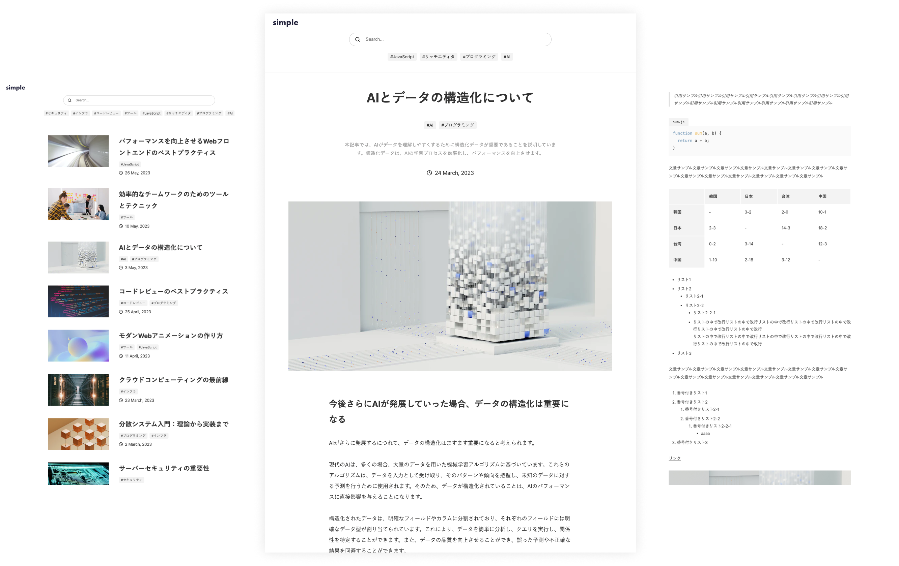
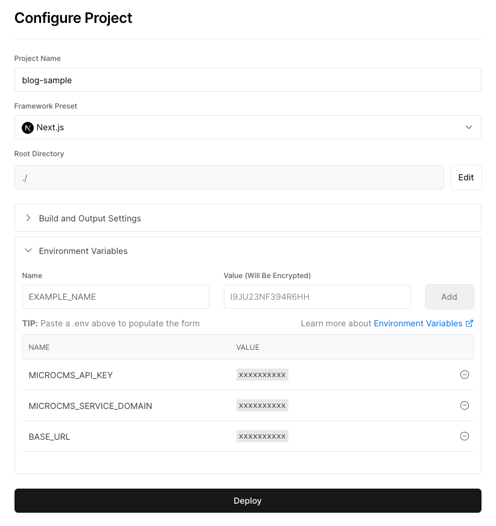

# シンプルなブログ



microCMS 公式のシンプルなブログのテンプレートです。

## 動作環境

Node.js 24 以上

## 環境変数の設定

ルート直下に`.env`ファイルを作成し、下記の情報を入力してください。

```
MICROCMS_API_KEY=xxxxxxxxxx
MICROCMS_SERVICE_DOMAIN=xxxxxxxxxx
BASE_URL=xxxxxxxxxx
```

`MICROCMS_API_KEY`  
microCMS 管理画面の「サービス設定 > API キー」から確認することができます。

`MICROCMS_SERVICE_DOMAIN`  
microCMS 管理画面の URL（https://xxxxxxxx.microcms.io）の xxxxxxxx の部分です。

`BASE_URL`
デプロイ先の URL です。プロトコルから記載してください。

例）  
開発環境 → http://localhost:3000  
本番環境 → https://xxxxxxxx.vercel.app/ など

### GitHub Actionsへの環境変数の設定

このリポジトリではPlaywrightによるE2Eテストが実装されています。
GitHubに変更をプッシュする、あるいはPull Requestを作成すると自動でテストが実行されます。

利用するにはGitHub Actionsのシークレットへの設定が必要です。
[こちらの手順](https://docs.github.com/ja/actions/how-tos/write-workflows/choose-what-workflows-do/use-secrets)に従って、`MICROCMS_API_KEY`と`MICROCMS_SERVICE_DOMAIN`をシークレットに設定してください。

## 開発の仕方

1. パッケージのインストール

```bash
npm install
```

2. 開発環境の起動

```bash
npm run dev
```

3. 開発環境へのアクセス  
   [http://localhost:3000](http://localhost:3000)にアクセス

## 画面プレビューの設定

下書き状態のコンテンツをプレビューするために、microCMS管理画面にて画面プレビューの設定が必要です。

ブログAPIの「API設定 > 画面プレビュー」に下記のように設定してください。  
※`your-domain`部分はデプロイ先のドメインに置き換えてください。（localhost指定でも動作します）


設定後はコンテンツ編集画面にて画面プレビューボタンが利用可能になります。

## Vercel へのデプロイ

[Vercel Platform](https://vercel.com/new?utm_medium=default-template&filter=next.js&utm_source=create-next-app&utm_campaign=create-next-app-readme)から簡単にデプロイが可能です。

リポジトリを紐付け、環境変数を `Environment Variables` に登録後、デプロイしてみましょう。



## Node.js のバージョンについて

このテンプレートは **Node.js 24 以上**を前提としています。

Node.js では定期的にセキュリティアップデートが提供されています。  
安全にご利用いただくため、Node.js を利用する際は
**利用中のメジャーバージョン（例: 24.x）の最新パッチバージョンを使用することを推奨します。**

最新のセキュリティ情報については、以下をご参照ください。
https://nodejs.org/ja/blog/vulnerability/

## このテンプレートに含まれる `.npmrc` について

このテンプレートには、npm の `min-release-age` と `registry` 設定を有効にするための `.npmrc` ファイルが含まれています。

```ini
min-release-age=7
registry=https://npm.flatt.tech
```

`min-release-age` はサプライチェーン攻撃対策の一環として設定しているもので、公開から7日未満の npm パッケージバージョンをインストール対象から除外します。これにより、悪意のあるパッケージや改ざんされたパッケージが公開直後に利用されるリスクを軽減できます。

`registry` はレジストリを [Takumi Guard](https://flatt.tech/takumi/features/guard)（GMO Flatt Security が提供する npm セキュリティプロキシ）に向けるもので、`npm install` 時にパッケージを既知の脅威データベースと照合し、悪意のあるパッケージのインストールをブロックします。トークンなしの匿名利用で有効になり、追加の設定は不要です。この設定はローカルだけでなく、GitHub Actions や Dependabot による依存更新にも適用されます。

プロジェクトの要件や運用方針に応じて、これらの値を変更したり、設定を削除したりすることも可能です。
